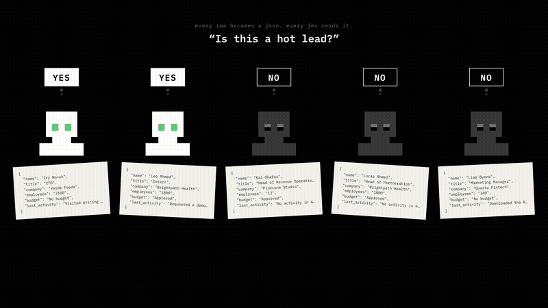

# yes or no jev?

Ask one yes/no question about every row of a CSV, then watch a squad of impossibl **JEVs** answer it live, row by row.

[](docs/media/demo.mp4)

▶ **[Watch the full demo (53s, with sound)](docs/media/demo.mp4)**

- **Drop a CSV, ask a question** like *"Is this a hot lead?"*. Each row is sent to JEV as a JSON object.
- **Watch it fill in real time.** Up to 10 JEVs work in parallel, and a tiny robot on each row blinks, thinks, nods (yes) or shakes its head (no).
- **Filter and export** only the yes rows, only the no rows, or every row with a new yes/no column you name yourself.

JEV (`typesafe-ai/jev`) is a decision model served by the [impossibl.com](https://impossibl.com) API. It doesn't write text. It returns the calibrated probability that a statement is true for the data, which makes it fast and very cheap: about **$0.000021 per row**, so the **$3 of free credit covers roughly 142,857 rows** (measured over 10 real calls, see [the benchmark](#cost-benchmark)).

---

## Quick start (Docker)

```bash
cp .env.example .env        # then paste your key: IMPOSSIBL_API_KEY=imp-...
docker compose up --build
```

Open **http://localhost:3000**. That's it.

> Port 3000 busy? `PORT=8080 docker compose up --build`.

## Get an API key

Create a free account at **[impossibl.com](https://impossibl.com)**. New accounts come with $3 of credit. You can either put the key in `.env` (the server uses it) or paste it on the welcome screen (it stays in your browser and is only forwarded to your own server).

## Use it

1. On the welcome screen, click **continue with the server key** (or paste your own key).
2. Drop your CSV anywhere on the page, or click **+ add new csv**. The first row must be the header.
3. Press <kbd>Tab</kbd> to accept a suggested question, or type your own yes/no question, then press <kbd>Enter</kbd>.
4. Watch the rows fill in. Use **filter**, then **export** to download the result.

Handy shortcuts: <kbd>/</kbd> focuses the question, <kbd>Tab</kbd> accepts the suggestion, <kbd>Esc</kbd> closes dialogs. Asking the same question again only fills rows that are missing or errored; a new question starts over. If a filter is active, only the rows it shows are sent.

## Local development

Requires Node.js 22.13+ (the server uses the built-in `node:sqlite`).

```bash
npm install
npm run dev          # Hono API on :3000 + Vite on :5173 (open http://localhost:5173)
```

| Command | What it does |
| --- | --- |
| `npm run dev` | Server (tsx watch) and web app (Vite) together |
| `npm test` | Unit + integration tests (Vitest) |
| `npm run typecheck` | TypeScript across all workspaces |
| `npm run lint` | ESLint |
| `npm run build` | Production build of web + server |
| `npm run benchmark -- file.csv` | Re-measures the real cost per row (10 JEV calls on your CSV) |

## Project layout

```
apps/server     Hono API: JEV client, job runner, SSE stream, cost benchmark
apps/web        Vite + React app (impossibl design tokens in src/styles/tokens.css)
packages/shared Types and constants shared by server and web
```

### How a run works

1. The browser parses the CSV (Papa Parse) and uploads it once (`POST /api/datasets`). The server stores it in SQLite.
   Asking a question calls `POST /api/datasets/:id/runs`; the server reads the rows from the database.
2. The server runs a pool of at most 10 workers. Each row becomes one call to `POST https://api.impossibl.com/v1/systemone` with the row as `state` and a single `noul` (yes/no) question: *"Is the following statement true for this data? Statement: …"*.
3. A probability of 0.5 or more means **yes**, anything lower means **no**. Transient errors (429/5xx) are retried twice, and an invalid key or empty balance stops the job.
4. Each answer is saved to SQLite as it arrives and streamed to the browser over Server-Sent Events (`GET /api/jobs/:id/events`), so the table updates as each row lands. Reloading the page mid-run picks the stream back up.

### Where your data lives

Datasets and results live in a SQLite file that the server **creates on first start and reuses afterwards**:

| Where you run it | Database file |
| --- | --- |
| `npm run dev` / `npm start` | `apps/server/data/yesornojev.sqlite` |
| Docker | `/app/data/yesornojev.sqlite` in the `yesornojev-data` volume |

Set `DATABASE_PATH` to put it elsewhere. The file is git-ignored. To start over, stop the server and delete it (Docker: `docker compose down -v`). The browser only remembers your settings, API key and last selected dataset.

### Cost benchmark

`npm run benchmark -- path/to/your.csv "Your question?"` sends 10 real requests over the first rows of your CSV, then reads the **billed** cost of each one from impossibl's request log (`GET /v1/requests`, `costCredits`). The average goes into `apps/server/src/data/benchmark.json`, which feeds the "$3 free" welcome screen. The latest run measured **$0.000021 per row, so about 142,857 rows for $3**.

## Design decisions and limitations

- **Visual style** follows [impossibl.com/design](https://impossibl.com/design): black, mono, lowercase, sharp corners, white as the only brand color, dithered data. The robot is impossibl's own 7×7 identity sprite, and its eyes move in cuts, never tweens. The site's display font (RT Alias Rough) is commercial, so figures use Inter Tight Light as an open substitute.
- **Datasets are shared by everyone using the same server.** This is a single-team tool: there are no user accounts, so every visitor sees the same list.
- **Live jobs run in memory.** Answers already received are saved, but restarting the server stops a run in progress (it shows as "stopped"; ask again to fill the gaps).
- **At most 10 parallel JEVs**, enforced on both the client and the server.
- **The server key is shared.** If `IMPOSSIBL_API_KEY` is set, anyone who can open the app can spend it. For a shared deployment, set `ALLOW_SERVER_KEY=false` so every user must paste their own key.

---

<p align="center">
  powered by
  <a href="https://impossibl.com">
    <picture>
      <source media="(prefers-color-scheme: dark)" srcset="apps/web/public/brand/impossibl-icon-white.svg">
      
    </picture>
    impossibl
  </a>
</p>
